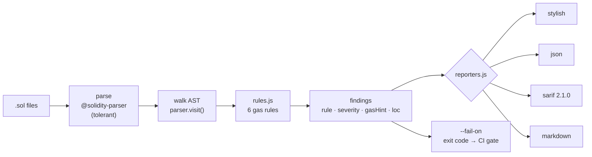

<div align="center">



<br/>

[](#-quick-start)
[](#-rules)
[](#-architecture)
[](#-roadmap)

<br/>


### ⛽🔪 Slash the gas your smart contracts waste — before they hit mainnet.

**Solidity Gas-Slasher** is a static analyzer that walks the Solidity AST, flags well-known gas
anti-patterns, and tells you the exact refactor and the gas it saves. It runs purely on
[`@solidity-parser/parser`](https://github.com/solidity-parser/parser) — **no `solc`, no compilation,
no project dependencies required** — so it drops into any repo or CI pipeline in seconds and emits
**SARIF / JSON / Markdown** for code-scanning and pull-request gates.

</div>

---

## 📑 Table of Contents

- [✨ Features](#-features)
- [🔍 Rules](#-rules)
- [🏗 Architecture](#-architecture)
- [⚡ Quick Start](#-quick-start)
- [🗺 Roadmap](#-roadmap)
- [⚖️ Attribution](#️-attribution)
- [💚 Support / Crypto Donations](#-support--crypto-donations)
- [📄 License](#-license)

---

## ✨ Features

<table>
<tr>
<td width="33%" valign="top">

### 🌳 Zero-compile AST
Parses contracts with `@solidity-parser/parser` (ANTLR, **tolerant mode**). No `solc`, no node
imports of your contract, no build step — point it at a folder and go.

</td>
<td width="33%" valign="top">

### ⚡ Gas-savings hints
Every finding ships a concrete refactor **and** an estimated saving (per-iteration, deploy-time, or
runtime), so you know whether a fix is worth it.

</td>
<td width="33%" valign="top">

### 🧩 Modular rules
ESLint-style visitors — each rule is an isolated AST walker. One rule throwing never crashes the
run, and adding a rule is a single function.

</td>
</tr>
<tr>
<td width="33%" valign="top">

### 🚦 CI-ready gating
`--fail-on low|medium|high` returns a non-zero exit code so a noisy diff fails the build before it
ships.

</td>
<td width="33%" valign="top">

### 📤 Four output formats
**stylish** for humans, **JSON** for pipes, **SARIF 2.1.0** for GitHub code scanning, **Markdown**
for PR comments and reports.

</td>
<td width="33%" valign="top">

### 📂 Recursive scanning
Point it at a file or a tree; it walks `.sol` files and auto-skips `node_modules`, `lib`,
`artifacts`, `cache`, `out`, `build`.

</td>
</tr>
</table>

---

## 🔍 Rules

Six gas rules ship today. Severity drives the SARIF level (`high → error`, `medium → warning`,
`low → note`) and the `--fail-on` gate.

| Rule | What it catches | Severity | Saving (≈) |
|------|-----------------|:--------:|------------|
| `cache-array-length` | `.length` read inside a `for` condition (repeated `SLOAD` / `length`) | 🟠 medium | ~3–100 gas / iteration |
| `increment-prefix-unchecked` | `i++` loop counters that could be `++i` inside `unchecked { }` | 🟡 low | ~5 gas (`++i`) + ~30–40 gas (`unchecked`) / iter |
| `custom-errors` | `require(cond, "string")` that could be a custom `error` | 🟠 medium | string storage (deploy) + cheaper revert (runtime) |
| `calldata-params` | `memory` reference params on `external` / `public` functions | 🟠 medium | avoids `calldata → memory` copy |
| `uint-gt-zero` | `x > 0` on unsigned values that should be `x != 0` | 🟡 low | ~3 gas |
| `constant-immutable` | literal-initialized state vars that could be `constant` / `immutable` | 🟡 low | `SLOAD` (2100 / 100) → ~0 |

> Gas figures are heuristic estimates. Confirm real numbers with a profiler
> (`forge snapshot`, `eth-gas-reporter`) before optimizing hot paths.

---

## 🏗 Architecture

A single pass: parse once, walk the AST through every rule, collect findings, then hand them to the
chosen reporter. The `--fail-on` gate turns the worst severity into an exit code for CI.



```text
src/
  cli.js         # arg parsing, .sol discovery (skips node_modules/lib/…), exit codes
  analyzer.js    # parse (@solidity-parser) + run every rule → sorted findings
  rules.js       # 6 gas rules as AST visitors (add() pushes a finding)
  reporters.js   # stylish · json · sarif · markdown
test/
  sample.sol     # contract triggering all 6 rules
  test.js        # framework-free assertions over the findings
```

---

## ⚡ Quick Start

**Requirements:** Node.js 18+.

```bash
# 1. Install
git clone https://github.com/DuminAndrew/solidity-gas-slasher
cd solidity-gas-slasher
npm install

# 2. Scan a folder (human-readable output)
npx gas-slasher contracts/

# 3. Pick a format and write a report
npx gas-slasher MyToken.sol -f md    -o gas-report.md
npx gas-slasher .           -f json  -o gas.json
npx gas-slasher .           -f sarif -o gas.sarif

# 4. Gate CI: exit code 2 if anything at/above this severity is found
npx gas-slasher . -f sarif --fail-on medium

# Run the test suite
npm test
```

**Flags**

| Flag | Values | Default | Purpose |
|------|--------|---------|---------|
| `-f`, `--format` | `stylish` · `json` · `sarif` · `md` | `stylish` | Output format |
| `--fail-on` | `low` · `medium` · `high` | _off_ | Exit `2` when max severity ≥ threshold |
| `-o`, `--output` | `<file>` | stdout | Write the report to a file |
| `-h`, `--help` | — | — | Show usage |

**GitHub Action** — gate pull requests and upload findings to the Security tab:

```yaml
name: gas-slasher
on: [pull_request]

jobs:
  gas:
    runs-on: ubuntu-latest
    steps:
      - uses: actions/checkout@v4
      - uses: actions/setup-node@v4
        with: { node-version: 18 }
      - run: npm ci
      - name: Run Gas-Slasher
        run: npx gas-slasher contracts/ -f sarif -o gas.sarif --fail-on medium
      - name: Upload SARIF
        if: always()
        uses: github/codeql-action/upload-sarif@v3
        with: { sarif_file: gas.sarif }
```

---

## 🗺 Roadmap

- [ ] **TypeScript rewrite + VS Code extension** — inline diagnostics and quick-fixes in the editor.
- [ ] **Deep mode via `solc` AST** — storage packing and true immutability analysis beyond heuristics.
- [ ] **Autofix engine** — apply safe refactors (`++i`, `!= 0`, cached length) automatically.
- [ ] **More rules** — `<` vs `<=` bounds, `++` on storage, redundant `SLOAD`s, `bytes32` over `string`, packed structs.
- [ ] **Config file** — per-project rule toggles and severity overrides.

---

## ⚖️ Attribution

Rule **ideas** are inspired by the public optimization catalogs of
[Slither](https://github.com/crytic/slither) (Trail of Bits) and
[solhint](https://github.com/protofire/solhint). **No Slither code is used or copied** — Slither is
AGPL-3.0; only the publicly documented optimization concepts informed these heuristics, which are
implemented from scratch on a plain AST. This project is released under the permissive MIT license.

---

## 💚 Support / Crypto Donations

If Gas-Slasher saved you some wei, you can fuel further development. **Replace the placeholders below
with your real, verified addresses + QR images before publishing.**

<table>
<tr>
<th>Coin</th><th>Network</th><th>Address (placeholder)</th><th>QR</th>
</tr>
<tr>
<td><b>BTC</b></td>
<td>Bitcoin</td>
<td><code>bc1qXXXXXXXXXXXXXXXXXXXXXXXXXXXXXXXXXXXXXX</code></td>
<td></td>
</tr>
<tr>
<td><b>ETH</b></td>
<td>Ethereum / EVM</td>
<td><code>0xXXXXXXXXXXXXXXXXXXXXXXXXXXXXXXXXXXXXXXXX</code></td>
<td></td>
</tr>
<tr>
<td><b>USDT</b></td>
<td>TRON (TRC20)</td>
<td><code>TXXXXXXXXXXXXXXXXXXXXXXXXXXXXXXXXXX</code></td>
<td></td>
</tr>
</table>

### 🔐 Donation safety

- Verify the address **only** on the official release page of this repository.
- Match the network exactly — **TRC20 ≠ ERC20**; sending to the wrong chain loses funds.
- Donations are **voluntary**: no SLA, no refunds, and not an investment.
- Maintainers will **never DM you** asking for donations or "validation" transfers.

---

## 📄 License

Released under the **MIT License** © [Andrew Dumin](https://github.com/DuminAndrew).

<div align="center">

<br/>

[](https://github.com/DuminAndrew/solidity-gas-slasher/stargazers)

**⛽🔪 Slash the gas. Ship leaner contracts.**

</div>
